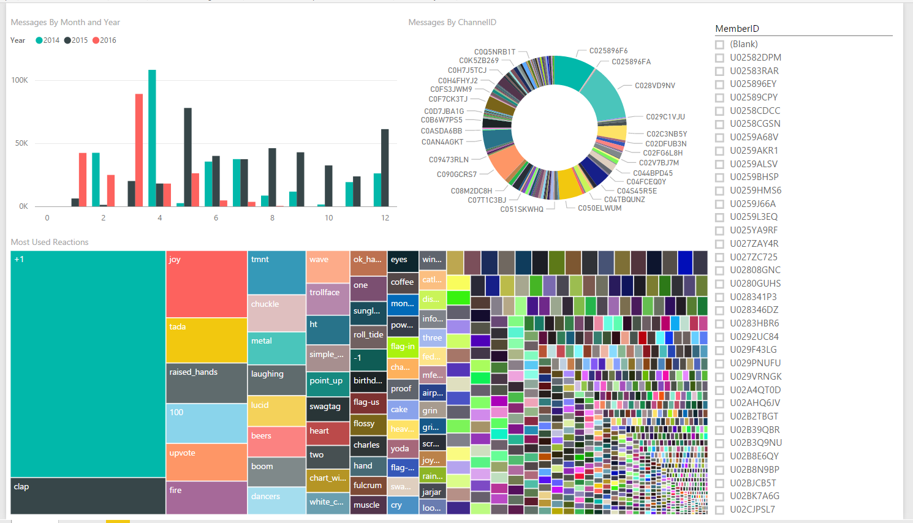
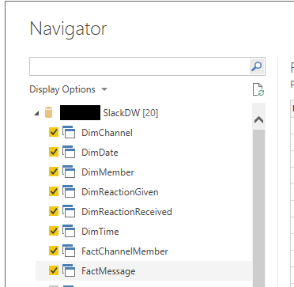
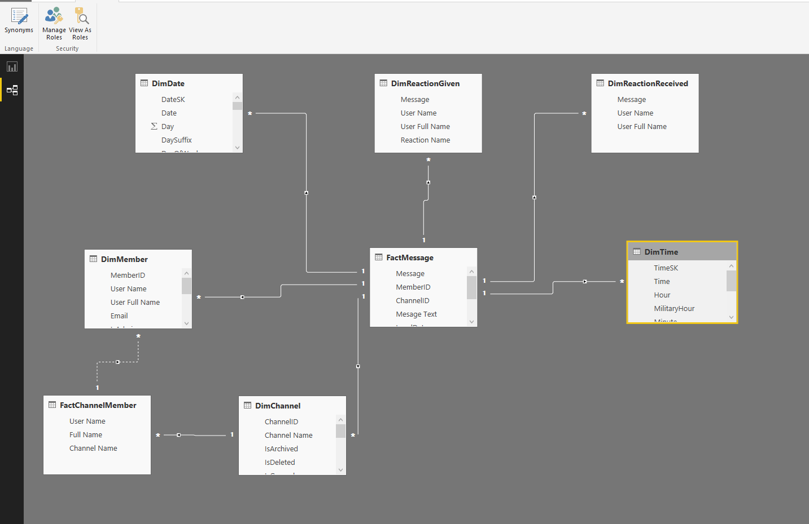

# PoshSlackDW

A quick and dirty side project to load and visualize data from our team's Slack using PowerBI. 



Note: This is some-what stale and was created a while back with no TLC.  I've decided to add some documentation and make the repo public.  If you have something cool or more recent to share please do!

### Dependencies
- PowerShell
- A SQL Server
    - Yes this is specifically targeted at SQL Server, currently.
- This uses `Invoke-SQLCmd` heavily from the `SQLPS` module, it could be ported to use the SqlClient libraries in .NET, however I have not done that yet.
    - This means it currently requires the `SQLPS` module that is bundled with SQL.
- Your Slack API key is required (no surpise there).

### Running
On initial run, we need to create the database, tables, and time/date dimensions.  Before loading any data, you need to pass the `-InitDB` switch to accomplish this.
```powershell
.\PoshSlack.ps1 -InitDB -SlackToken 'XXXXXXXXXXXXXXXX' -SQLHost 10.1.2.3 # If using SQL Server authentication, you can pass -DBUser 'someUser' -DBPass 'somePassword'
```
After the DB is created, this will continue on and carry out a full historical load of the data from Slack.

On subsequent runs, **DO NOT** pass the `-InitDB` flag.

For more info:
```powershell
Get-Help PoshSlack.ps1
```

### PowerBI
Connect to the SQL Server and load only the views, not the tables in the `stage` schema.


This what they should appear like in the manage relationships tab, if they aren't auto "figured-out" by PowerBI.


After that, create any crazy dashboards you would like!

### Issues
- This was the first time I've ever tried doing something related to star schema and data-warehouseing, along with playing around with PowerBI. :)
- There are probably (in fact I'm sure) better ways of doing this
- It isn't a true star schema
- The modeling was giving me issues
    - Messages can have many Reactions, and a single person can leave many different Reactions on one Message
        - Made mapping "Reactions given" to "Reactions received" tricky
    - User stars don't always map directly to Messages
    - User groups have nothing to do with Messages
    - Channel membership has nothing to do with Messages

### Ideas
- Do NLP on the Messages
    - Mood by time of day
- User by curse word count
    - This was pretty easy using DAX in PBI and filtering on curse words, but there may be better ways
- Reaction interpretation
- ???

### License
[MIT](LICENSE)